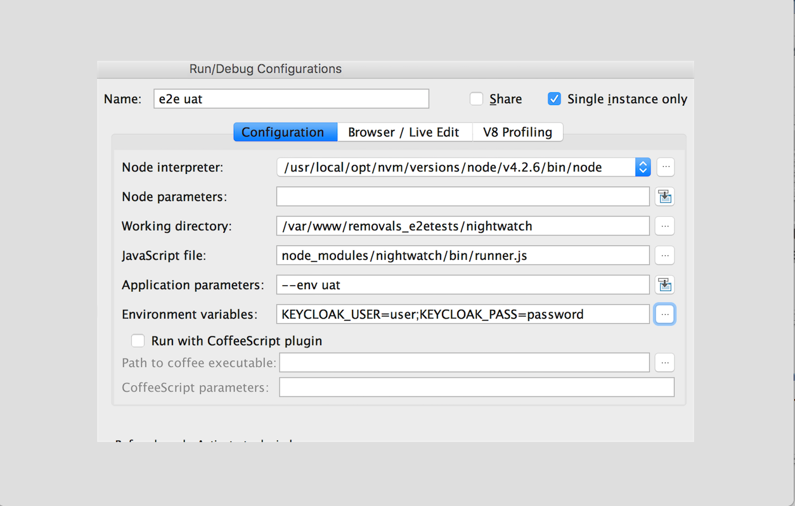
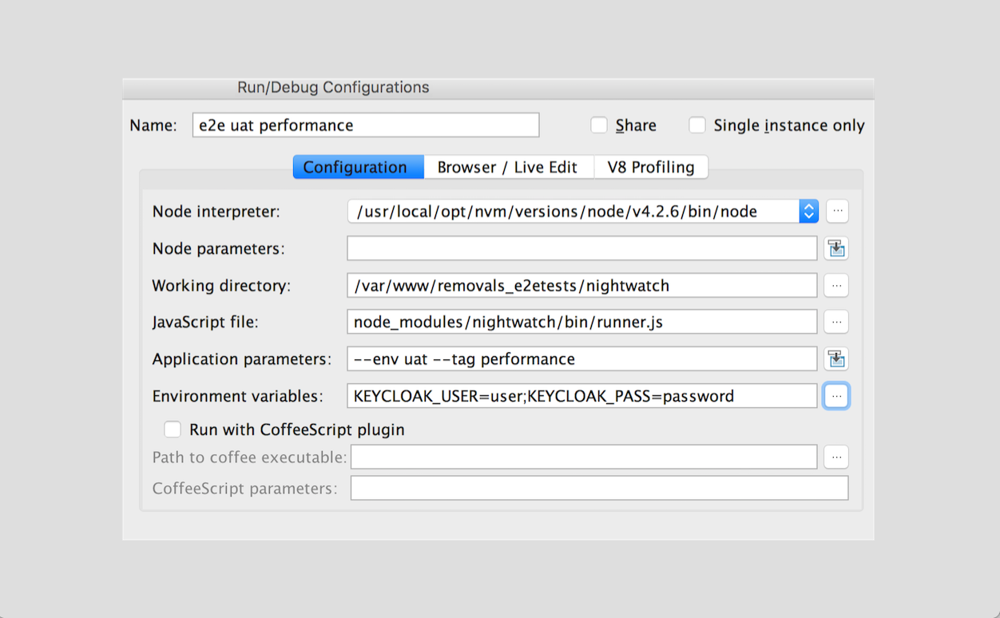

# End to End Feature & Performance Tests

[](https://travis-ci.org/UKHomeOffice/removals_e2etests)

There are two ways to run the tests, if you want to just get started quickly then use docker, if you want to integrate this into your IDE for example you might prefer to run the code on your machine.

## IBM Environments
| env | backend | frontend |
| --- | ------- | -------- |
| default | http://localhost:8080 | http://localhost:8000 |
| docker | http://backend | http://frontend |
| dev | https://api-dev.notprod.ircbd.homeoffice.gov.uk | https://wallboard-dev.notprod.ircbd.homeoffice.gov.uk |
| int | https://api-int.notprod.ircbd.homeoffice.gov.uk | https://wallboard-int.notprod.ircbd.homeoffice.gov.uk |
| uat | https://api-uat.notprod.ircbd.homeoffice.gov.uk | https://wallboard-uat.notprod.ircbd.homeoffice.gov.uk |

## Running the code on your machine:
```shell
# Install nvm
curl -o- https://raw.githubusercontent.com/creationix/nvm/v0.31.0/install.sh | bash
source ~/.nvm/nvm.sh

# Install & Use Node 4
nvm install 4
nvm use 4
cd removals_e2etests/nightwatch
npm install
```

## Run tests against an environment
```shell
# Start the [FE Application] (https://github.com/UKHomeOffice/removals_wallboard)
cd removals_wallboard
gulp dev

# Start the [API Application] (https://github.com/UKHomeOffice/removals_integration)
cd removals_integration
PORT=8080 npm start

# Run the e2e tests locally
cd removals_e2etests/nightwatch
./test.sh

# Setup the keycloak credentials file & Run the e2e tests against a remote environment
cd removals_e2etests
echo "KEYCLOAK_USER=myusername
KEYCLOAK_PASS=mypassword" > mycredentials

cd removals_e2etests/nightwatch
./test.sh [docker|dev|int|uat]
```

##Run e2e tests against a local environment with docker-compose
```shell
# Build the [API Application] (https://github.com/UKHomeOffice/removals_integration)
cd removals_integration
docker build -t removals_integration .

# Build the [FE Application] (https://github.com/UKHomeOffice/removals_wallboard)
cd removals_wallboard
docker build -t removals_wallboard .

# Run tests
./runtests.sh --env docker
```

## Run e2e tests against a remote environment with docker-compose
```shell
# Setup the keycloak credentials file
cd removals_e2etests
echo "KEYCLOAK_USER=myusername
KEYCLOAK_PASS=mypassword" > mycredentials

# Run the e2e tests
./runtests.sh --env [dev|int|uat]
```

## Run e2e performance tests against a remote environment with docker-compose
```shell
# Setup the keycloak credentials file
cd removals_e2etests
echo "KEYCLOAK_USER=myusername
KEYCLOAK_PASS=mypassword" > mycredentials

# Run performance tests
./runtests.sh --env [docker|dev|int|uat] --tag performance
```

## Run e2e tests against an environment with IntelliJ
### Add a new Node.js Configuration setting for e2e testing

### Add a new Node.js Configuration setting for performance testing



# CI branch testing
Travis will try and fetch an image matching the same branch name of the `removals_integration` and `removals_wallboard` and test against that

# [Architecture](http://static.codingthearchitecture.com/c4.pdf)
### System context diagram

### Container/Component diagram

